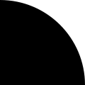
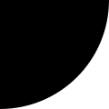
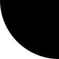
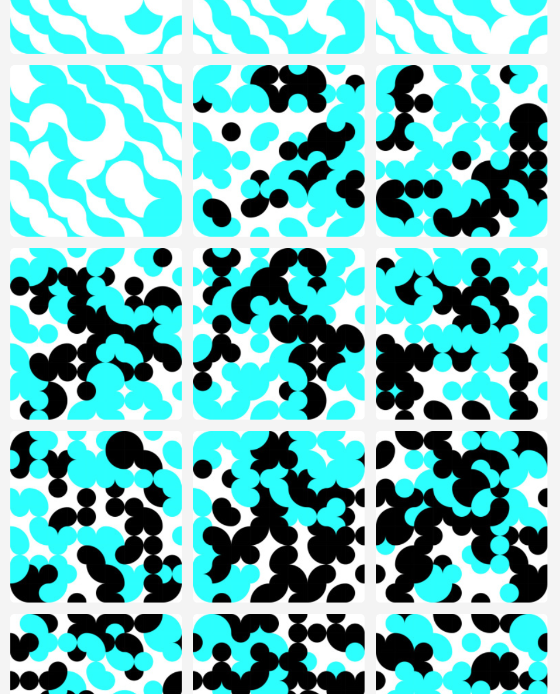

# Tiling

This project was inspired by some of [Asao Tokolo's](http://tokolo.com/) tiling designs.
I first learned about Tokolo when his design was selected for the 2020 Olympics in Tokyo.
You can read about that design, his tiles, and other works
[here](http://www.spoon-tamago.com/2016/04/26/who-is-asao-tokolo-the-designer-behind-tokyos-2020-olympic-emblem/).

The goal of this project was to create an image feed of interlocking tiles that would update automatically.
You can visit the feed here: [random-tiles.tumblr.com](https://random-tiles.tumblr.com/).
(I originally imagined the project would live on Instagram, but they have no API to post images, so it lives on Tumblr.)

## How it works

The project works by defining three object types: Tiles, Quilts, and QuiltSequences.

### Tiles

Tiles each have one foreground and one background colour, and any number of ellipse segments. For example, here is a basic set of black-on-white tiles:

      

The system creates tiles of different shapes and colours as needed by drafting SVG files from scratch. I followed [this post](http://nick.onetwenty.org/index.php/2010/04/07/creating-svg-files-with-python/) to get started. Ellipse segments are added using ElementTree. For example, this code generates the first tile above:

	from xml.etree import ElementTree as et
	# Set up canvas
	doc = et.Element('svg', width='120', height='120', version='1.1', xmlns='http://www.w3.org/2000/svg')
	# Paint white square for background (not strictly necessary for white, but )
	et.SubElement(doc, 'rect', width='120', height='120', fill='rgb(255, 255, 255)')
	# Paint black ellipse centered at bottom left (0,120) with same radii as canvas size (120)
	et.SubElement(doc, 'ellipse', cx='0', cy='120', rx='120', ry='120', fill='rgb(0, 0, 0)')
	# Save canvas to SVG
	f = open('b_sw_tempo.svg', 'w')
	f.write('<?xml version=\"1.0\" standalone=\"no\"?>\n')
	f.write('<!DOCTYPE svg PUBLIC \"-//W3C//DTD SVG 1.1//EN\"\n')
	f.write('\"http://www.w3.org/Graphics/SVG/1.1/DTD/svg11.dtd\">\n')
	f.write(et.tostring(doc))
	f.close()

Painting the background is not strictly necessary for this black-on-white tile, but obviously necessary in general. Also, instead of an ellipse, we could have used a "circle" command with a single "r" argument.

### Quilts

Quilts are arrays of tiles; each quilt is an individual image in the feed.

We can create them easily using [svgwrite.image.Image](https://svgwrite.readthedocs.io/en/latest/classes/image.html), which renders "the contents of a complete file ... into a given rectangle within the current user coordinate system." This means we simply need to set up square sectors within a new SVG drawing and have each sector point to one of the tiles we created:

	import scipy as sp
	import svgwrite
	filenames = ["b_ne", "b_se", "b_nw", "b_sw", "w_ne", "w_se", "w_nw", "w_sw"]
	# Define the dimensions of the tiles (in pixels), the grid (in number of tiles), and the page (in pixels).
	grid_w = 20
	grid_h = 10
	tile_w = 50
	tile_h = 50
	page_w = grid_w * tile_w
	page_h = grid_h * tile_h
	dwg = svgwrite.Drawing(filename = "./tmp_tile_grid_newnew_.svg", size = (str(page_w)+"px", str(page_h)+"px"))
	for i in range(grid_w):
		for j in range(grid_h):
			x_i = i*tile_w
			x_j = j*tile_h
			lab_k = sp.random.randint(len(filenames))
			image = svgwrite.image.Image("./"+filenames[lab_k]+".svg", insert=(x_i,x_j), size=(tile_w,tile_h))
			image.stretch()
			dwg.add(image)

	dwg.save()

The code above was used to generate the image below:

To ensure that the tiles within a quilt match up in terms of colour, I updated the Tile object definition so that it would know what its edge colours were, which makes it possible to choose only new tiles that align with already-chosen neighbours.

Unfortunately, choosing the tiles one by one, it is still easy to paint oneself into a corner so that no tiles fit. Mostly, I overcome this through brute force (repeatedly re-tiling until a viable pattern is found), but I recently added a slightly less naive method that has the ability to pop out of a local dead-end by stepping backward in its random search.

### Quilt Sequences

A QuiltSequence is a feed of Quilts. Unlike Tiles and Quilts, which have fixed widths and heights, a QuiltSequence has a fixed width but an indeterminate height: new Quilts can continually be added to the top.

The QuiltSequence object is designed to work iteratively: each new Quilt that's added must fit with its left and bottom neighbours, and in turn defines new constraints for the Quilts that are added later.

This is all done using the `extend_sequence` method, with which one defines new left and top edge colours, and optionally set new parameters for the tile groups, foreground and background colours of the tiles used to create the next quilts. This is where the design fun happens; the commands I used to generate my blog are saved in my rough work file, `use_tiles.py.` Here's an example excerpt of the blog:

### Final touches

Once you've made a quilt sequence that you're satisfied with, a few final steps are required to make the project work:

- Convert SVG files to images. Since SVG files can't be uploaded to Tumblr (or Instagram), we convert the SVG files into images (JPG or PNG) using the [ImageMagick](https://www.imagemagick.org/) command `convert'.`
- To publish the images to Tumblr, I use [PyTumblr](https://github.com/tumblr/pytumblr) --- their GitHub readme shows how to use the `create_photo` command to post from a local filepath. For [my blog](https://random-tiles.tumblr.com/), I generate a month's worth of pictures at once, post them all, and then set Tumblr to auto-post them in order at a specified rate.
- I save the QuiltSequence with [pickle](https://docs.python.org/3/library/pickle.html) so that I can pick up the project periodically to generate new images that fit with the sequence so far.
